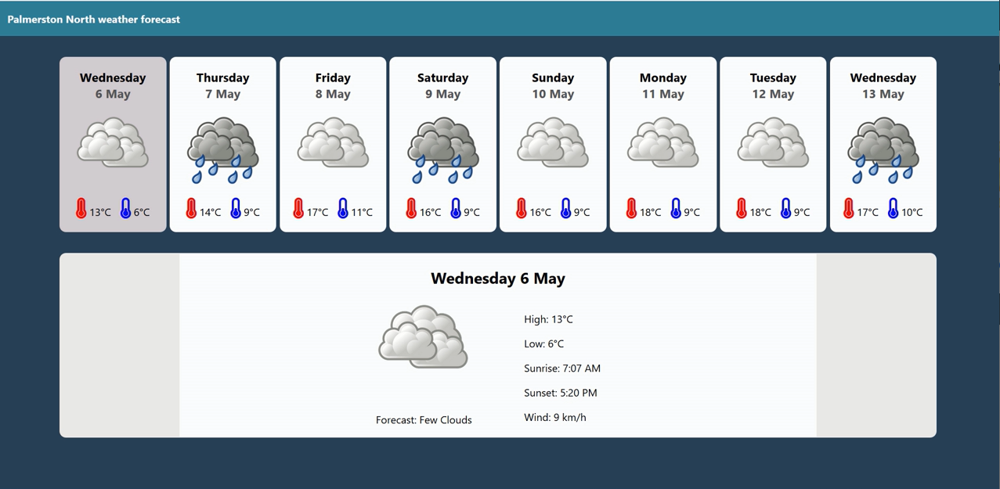

# Weather app

This website shows the basic weather forecast for the next 8 days. If you click on each of the days you can see the forecast in more detail.

## How to run
*Note that you will need to have [Node.js](https://nodejs.org) installed.*

Install the dependencies:
```
npm install
```

You will need to have a key for the [openweathermap](https://home.openweathermap.org) api - this project uses the "onecall" api which is under the free plan.

Add your key to "src/keys.js": eg. ```export let weather_key = '1234567890';```

To run the app on [localhost:5000](http://localhost:5000):
```
npm run dev
```
